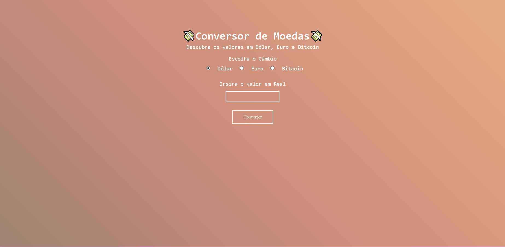

# Imersão Dev - Currency Converter

This is the solution to Imersão Dev's Currency Converter Challenge.

## Table of contents

- [Overview](#overview)
  - [The challenge](#the-challenge)
  - [Screenshot](#screenshot)
  - [Links](#links)
- [My process](#my-process)
  - [Built with](#built-with)
  - [What I learned](#what-i-learned)
  - [Useful resources](#useful-resources)

## Overview

### The challenge

The challenge consists in a currency converter where the user can make the conversion from Real(R$) to Dollar($) or Euro(€)

### Screenshot



### Links

- Live Site URL: [https://izuca.github.io/imersaoDev-Moedas/](https://izuca.github.io/imersaoDev-Moedas/)

## My process

### Built with

- HTML 5
- CSS 3
- Javascript
- Codepen

### What I learned

- How to make an animated background
```css
body { 
  animation: color 15s ease infinite;
}

/*Animação "color" referente ao background*/
@keyframes color{
  0% {
    background-position:0% 50%;
  }
  50% {
   background-position:100% 50%;
  }
  100% {
    background-position:0% 50%;
  }
}
```
- How to show the result on screen using innerHTML
```javascript
//Atribuição da conversão ao elemento de ID "valorConvertido"
  document.getElementById("valorConvertido").innerHTML = valorConvertido;
```

### Useful resources

- [W3Schools](https://www.w3schools.com/default.asp)
- [MDN Web Docs](https://developer.mozilla.org/pt-BR/)
- [Codepen](https://codepen.io)
- [Alura](https://www.alura.com.br)
